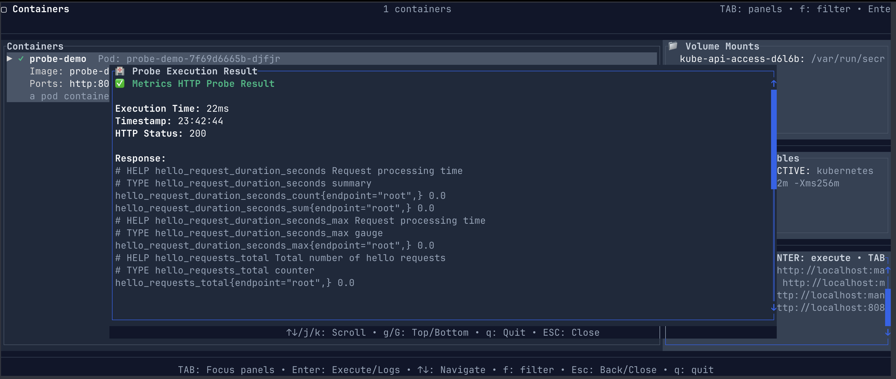

[](https://crates.io/crates/navipod)
[](https://docs.rs/navipod)
[](https://github.com/navicore/navipod/actions/workflows/publish-crates.yml)
[](https://github.com/navicore/navipod/actions/workflows/rust.yml)
[](https://github.com/navicore/navipod/actions/workflows/dependabot/dependabot-updates)

# NaviPod

A comprehensive TUI and CLI for inspecting containers in Kubernetes clusters.


## Overview

NaviPod provides a modern terminal interface for Kubernetes operations, built
with Rust for performance and reliability. The tool uses local kubecontext
credentials to access Kubernetes clusters and offers both interactive TUI and
scriptable CLI modes.

## Key Features

### Terminal User Interface (TUI)

- **Multi-view Navigation**: Navigate between deployments, pods, containers, and logs
- **Container Inspection**:
  - View environment variables, volume mounts, and resource limits
  - Execute liveness, readiness, and startup probes and view results
  - Inspect container logs with smart tailing and filtering
- **Interactive Probe Testing**:
  - Support for HTTP, TCP, and Exec probe types
  - Detailed response viewing with scrollable popup windows
- **Log Viewer**:
  - Log streaming with tailing
  - Log level detection and color coding
  - Detailed log entry viewer
  - Filtering and search capabilities
- **Keyboard Navigation**:
  - Vim-style keybindings (j/k, g/G)
  - Tab navigation between panels

### Command Line Interface

- **Pod Analysis**: Report on pod external ingress configurations
- **Metrics Collection**: Gather Prometheus metrics from annotated pods
- **RDF Export**: Export cluster data to N-Triples or Turtle RDF formats
- **Database Operations**: Embedded database for offline analysis
- **Shell Completion**: Auto-completion support for bash and zsh

### Architecture

- **Async/Await**: Non-blocking operations for responsive UI
- **Modular Design**: Clean separation between Kubernetes API, UI, and data layers
- **Theme System**: Customizable color schemes
- **Error Handling**: Comprehensive error handling with user-friendly messages
- **Caching**: Intelligent caching for improved performance

## Prometheus Integration

NaviPod automatically discovers and collects metrics from pods annotated with:

```yaml
annotations:
  prometheus.io/scrape: "true"
  prometheus.io/path: "/actuator/prometheus"
  prometheus.io/port: "8081"
```

## Installation

### From crates.io

```bash
cargo install navipod
```

### From source

```bash
git clone https://github.com/navicore/navipod.git
cd navipod
cargo install --path .
```

### Shell Completion

For zsh:
```zsh
navipod generate-completion zsh > /usr/local/share/zsh/site-functions/_navipod
```

For bash:
```bash
navipod generate-completion bash > /etc/bash_completion.d/navipod
```

## Usage

### Interactive TUI

```bash
# Start the TUI with default namespace
navipod tui

# Start with specific namespace
navipod tui -n production
```

#### TUI Navigation

- `Tab/Shift+Tab`: Switch between panels
- `j/k` or `↑/↓`: Navigate lists
- `Enter`: Select item or execute probe
- `g/G`: Jump to top/bottom
- `/`: Search/filter
- `ESC`: Go back or close popup
- `q`: Quit application
- `c`: Cycle color themes

### CLI Commands

```bash
# Analyze pod ingress configuration
navipod explain-pod -n production

# Collect metrics to database
navipod scan-metrics -n production

# Export to RDF formats
navipod export-turtle -t cluster-data.ttl
navipod export-triples -r cluster-data.nt

# Show database statistics
navipod report
```

### Command Options

```
Options:
  -t, --ttl-rdf-filename <FILE>  Export Turtle RDF file [default: navipod.ttl]
  -r, --rdf-filename <FILE>       Export N-Triples RDF file [default: navipod.nt]
  -n, --namespace <NAMESPACE>     Kubernetes namespace to inspect
  -d, --db-location <PATH>        Database location [default: /tmp/navipod.db]
  -h, --help                      Print help information
  -V, --version                   Print version information
```

## Screenshots

### Health Probe Inspection


## Requirements

- Rust 1.89 or higher (for building from source)
- Valid Kubernetes configuration (`~/.kube/config`)
- Access to target Kubernetes clusters

## Development Status

Active development - New features and improvements are regularly added. The project serves as both a practical Kubernetes tool and a platform for exploring Rust programming patterns.

## Contributing

Contributions are welcome. Please ensure all changes maintain the existing code quality standards and pass the project's clippy lints.

## License

See LICENSE file for details.

