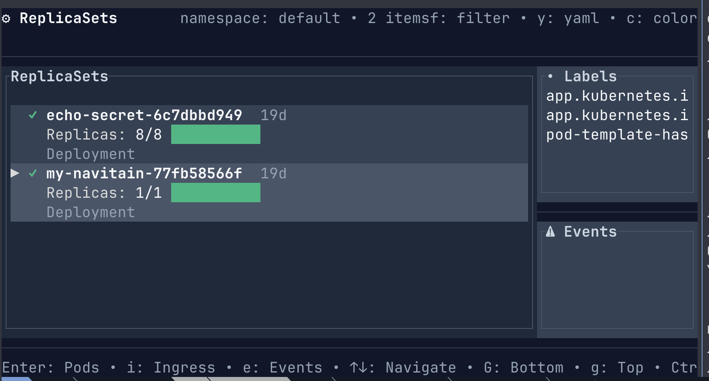

A CLI for Inspecting Containers in Kubernetes
============



UNDER CONSTRUCTION
-----------

Currently, the command will use a local kubecontext to access a cluster
and get all the Prometheus data available from pods annotated for Prometheus
using the convention:

```
      annotations:
        prometheus.io/scrape: "true"
        prometheus.io/path: "/actuator/prometheus"
        prometheus.io/port: "8081"
```

The cli supports exporting the db to both N-Triple and Turtle RDF files.

Planned - formatted output and liveliness and readiness probe info
in aggregated report form.

Install
----------

```bash
#latest stable version via https://crates.io/crates/navipod
cargo install navipod

#or from this repo:
cargo install --path .
```

Configure for tab completion:

```bash
navipod generate-completion zsh > /usr/local/share/zsh/site-functions/_navipod
```

Usage
---------

from `navipod -h`

```
A cli tool for inspecting containers in Kubernetes

Usage: navipod [OPTIONS] <COMMAND>

Commands:
  tui                  start text-based UI
  explain-pod          report on pod external ingress
  scan-metrics         collect pod metrics and write to db
  export-triples       export db data to RDF nt files
  export-turtle        export db data to RDF turtle files
  report               show db stats
  generate-completion  generate completion script for bash and zsh
  help                 Print this message or the help of the given subcommand(s)

Options:
  -t, --ttl-rdf-filename <TTL_RDF_FILENAME>  export Turtle RDF file [default: navipod.ttl]
  -r, --rdf-filename <RDF_FILENAME>          export N-Triples RDF file [default: navipod.nt]
  -n, --namespace <NAMESPACE>                Name of the namespace to walk
  -d, --db-location <DB_LOCATION>            [default: /tmp/navipod.db]
  -h, --help                                 Print help
  -V, --version                              Print version
```

TODO
--------

1. list readiness and liveliness info and prometheus health port and path
2. get probe health check info from ports
3. get prometheus metrics check info from ports
4. format output when -o yaml or -o json is used
